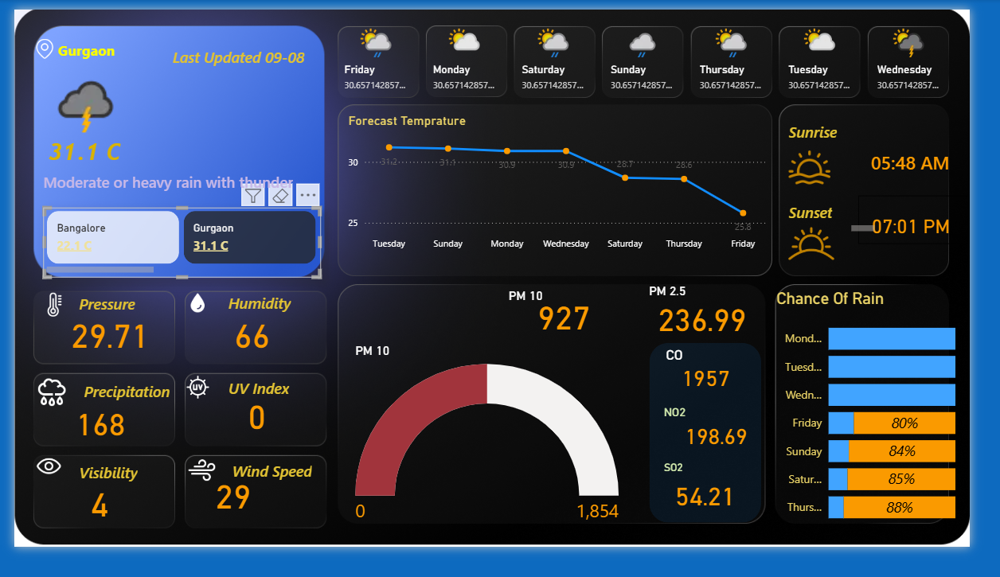

# Weather_Dashboard

## Step 1: Get Your WeatherAPI Key
Sign up at WeatherAPI.com, then copy your API key.

You’ll use this key to authenticate API calls.

 ## Step 2: Build the API URL
For current weather data, use:

bash

https://api.weatherapi.com/v1/current.json?key=YOUR_API_KEY&q=CITY_NAME

## Step 3: Connect Power BI to WeatherAPI
Open Power BI Desktop.

Click Get Data → Web.

Enter your WeatherAPI URL.

Click OK.

## Step 4: Transform the Data
Power BI will show a preview in the Power Query Editor:

Expand the current record.

Expand sub-records like condition or air_quality.

Rename columns for clarity.

Click Close & Apply.

## Step 5: Build Your Dashboard
Add:

✅Cards for temperature, humidity, etc

✅ Gauges for wind speed.

✅ Charts for daily variations.

And you can also set up filters/slicers for different cities.

## Step 6: Styling & Interactivity
Insert icons representing the current weather.

Plot the map visual with city locations.

Allow your users to select cities dynamically.
